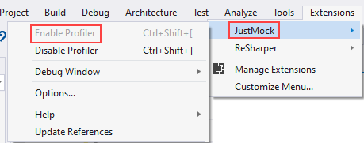

# About

This unit test project relies on a `commercial version` of `JustMock` from `Telerik`.

[See documentation](https://docs.telerik.com/devtools/justmock/getting-started/api-basics/system-api)

`JustMock` is a `service` which is controlled directly inside of Visual Studio

Using JustMock allows testing as in OED_TestProject1 in MainTest.cs

---
# DO NOT TRY AND COMPILE

