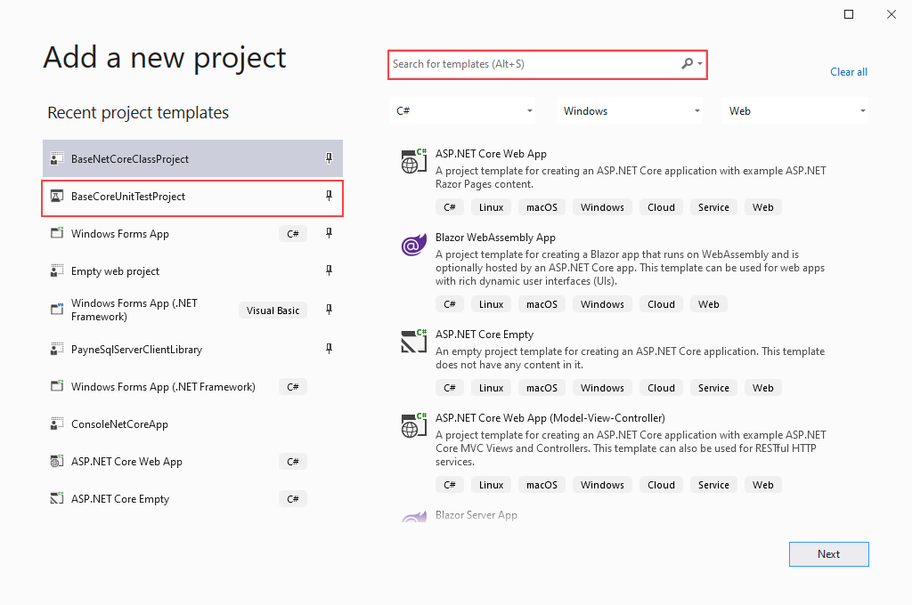
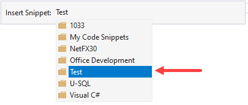
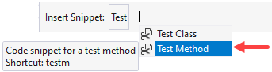

To create a unit tests the following is standard path to create a test class and test methods.

If the instructions given this week by email were followed I will do a walkthrough on using a predefined unit test project.



# Create a new test class

- Create a new class
- Add the following using statement

```csharp
    using Microsoft.VisualStudio.TestTools.UnitTesting;
```

- Add the following directly above the class name

```csharp
    [TestClass]
```

# Create a new test method

To create a test method press <kbd>CTRL</kbd> +  <kbd>K</kbd>, <kbd>V</kbd>



Select `Test Method` then press <kbd>Enter</kbd> which creates a new method ready for you to give a name to the method.



**Note** type `testm` <kbd>TAB</kbd> will also create a new test method as seen in the tool-tip above.